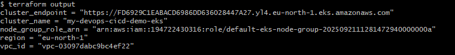
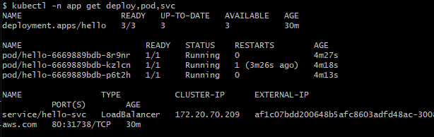
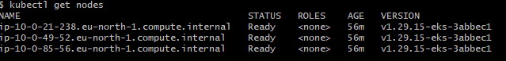
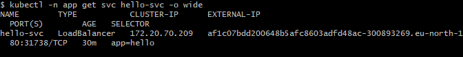
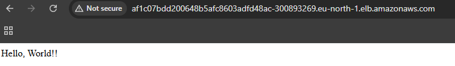
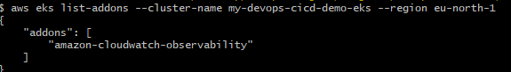

# EKS cluster
[](https://github.com/s1natex/devops-cicd-demo/actions/workflows/ci.yml)

A Hello World app Containerized and deployed to an EKS Cluster on AWS via automated CI/CD pipeline, featuring main branch protection with ci gate for pull requests

# ArgoCD
Used ArgoCD for alternative CICD with an initial Dev ci that builds runs tests push to registry and open pr where ArgoCD syncs with main protected branch

- #### [Argo CI flow Docs](.github/workflows/Argo-CI.md)
- #### For Legacy CICD activate "protection-to-main" Ruleset
- #### For ArgoCD activate "ArgoCD-protection-to-main" Ruleset

- ## [Argo CD Apply](./argo/ArgoCD.md)
- Manually Update the image tag in deployment.yaml for argoCD to sync

# Features
- Python Flask “Hello World” app (+ /healthz)
- Dockerized app + Docker Compose for local run
- Tests: unit + integration (+ e2e via Docker)
- Image publishing to Docker Hub with YYYYMMDD-<shortSHA> and latest
- Kubernetes manifests (Deployment, Service LoadBalancer, readiness/liveness)
- Scalable deploy: replicas=9 (EKS 3 nodes × ~3 pods)
- EKS cluster via Terraform (VPC, nodegroup, IRSA enabled)
- Remote Terraform state (S3 + DynamoDB lock) and GitHub OIDC role
- CI (GitHub Actions): unit+integration on PR to main; branch protection with required checks
- CD (manual workflow_dispatch with AWS OIDC): build - test - push - deploy to EKS, rollout status check
- Monitoring: CloudWatch + Container Insights addon (logs + metrics)

# Instructions for initial deployment:
### Terraform Bootstrap Local
- Run Bootstrap before using AWS to configure OIDC and Remote State with locking and Versioning
```
cd terraform/bootstrap
terraform init
terraform validate
terraform fmt
terraform plan
terraform apply

# Clean Up
terraform destroy
# Check AWS user
```
### [K8s EKS LOCAL initial Deployment via AWS](./k8s/EksTest.md)
- After initial deployment CI/CD handles deployments on any change to main branch
### EKS Clean Up
```
cd terraform/eks
kubectl delete namespace app
terraform destroy

cd terraform/bootstrap
terraform destroy
# Check AWS user
```
# Local Docker Desktop Deployment
### Terraform Bootstrap Local
- Run Bootstrap before using AWS
```
cd terraform/bootstrap
terraform init
terraform validate
terraform fmt
terraform plan
terraform apply
```
### [k8s LOCAL testing via Docker Desktop](./k8s/LocalTest.md)
### OR Local testing via docker compose
```
docker compose up --build

# URL: http://localhost:8000
# Health: http://localhost:8000/healthz

# Clean Up
docker compose down
```
# Screenshot Validation:
- **Terraform Output**



- **Pods and Services output via CLI**



- **Nodes on EKS**



- **LoadBalancerUp**



- **Hello World!**



- **DockerHub Image Tags**


- **Cloudwatch**


