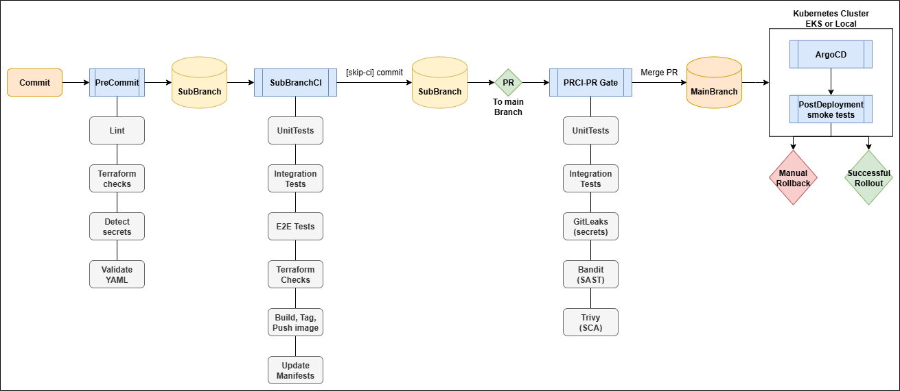

# Hello World to Production: CI/CD + GitOps on AWS EKS

- A `Hello World` app, containerized and deployed to `AWS EKS` via a GitOps Driven CI/CD pipeline
- Pull requests to `main` must pass tests before merge, and Argo CD continuously syncs `main` to the cluster for a secure GitOps delivery

## Project Overview:
- Python Flask “Hello World” app with `/healthz` endpoint
- Containerized with Docker, runnable locally via Docker Compose
- Automated tests: `unit`, `integration`, `end-to-end`
- Docker Hub publishing Tag: `YYYYMMDD-SHA`
- Kubernetes Manifests: `Namespace`, `Deployment`, `Service`, `HPA`, `Readiness Probes` and `Liveness Probes`
- **Terraform**:
  - Bootstrap: S3 bucket + DynamoDB for remote state
  - EKS cluster: VPC, node group, IRSA
  - GitHub OIDC `Commented` (not needed for current workflow)
- **GitHub Actions CI/CD**:
  - SubBranchCI:
    - Runs tests when `app/`, `tests/`, `docker-compose.yml` change
    - Runs Terraform `fmt`/`validate`/`plan` when `terraform/` changes
    - Builds & pushes image only if `app/` or `docker-compose.yml` changed
    - Updates k8s manifest with new tag and commits back when `Build & push` job succeeds
  - PRCI: on PRs to `main` → runs unit/integration tests + security scans (Gitleaks, Bandit, Trivy)
- **GitOps with ArgoCD**:
  - App-of-Apps pattern (root + hello application)
  - Automated sync (prune + self-heal) of `main` branch to `EKS` or `Docker-Desktop(local)`
  - PostSync smoke-test Job probes `/healthz` via Service to gate Rollouts
  - Rollback(Manual): `kubectl rollout undo` or `argocd app rollback`
- Ingress:
  - `argocd` Ingress → Argo CD dashboard
  - `hello` Ingress → app root `/` and `/healthz`
- Monitoring:
  - AWS CloudWatch + Container Insights (basic logs and metrics)

# CICD Diagram:

## Instructions and Screenshots:
- #### [Screenshot Validations](./docs/ScreenshotValidation.md)
- #### [Running locally with Docker Compose](./docs/dockercompose.md)
- #### [Running locally with Kubernetes on Docker Desktop](./docs/localcluster.md)
- #### [Running on AWS EKS cluster with Terraform](./docs/ekscluster.md)
